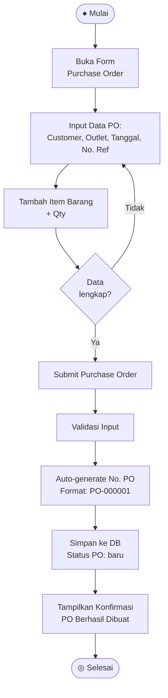
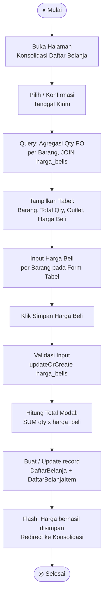
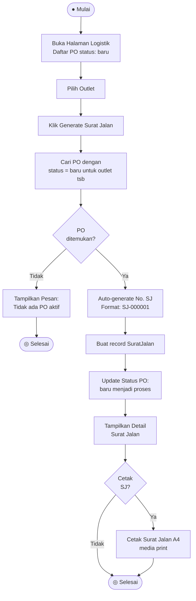
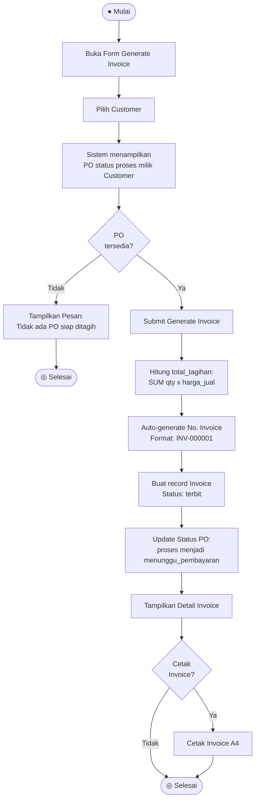
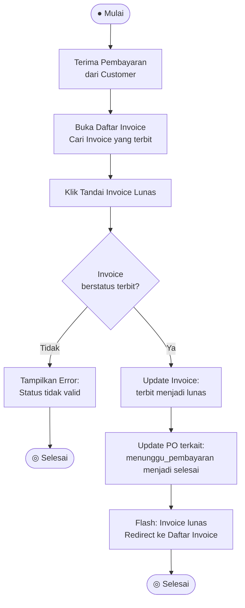
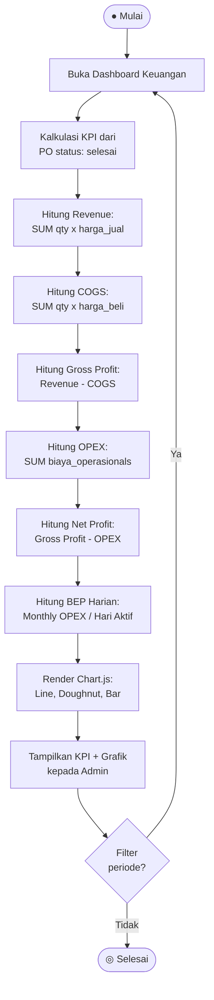
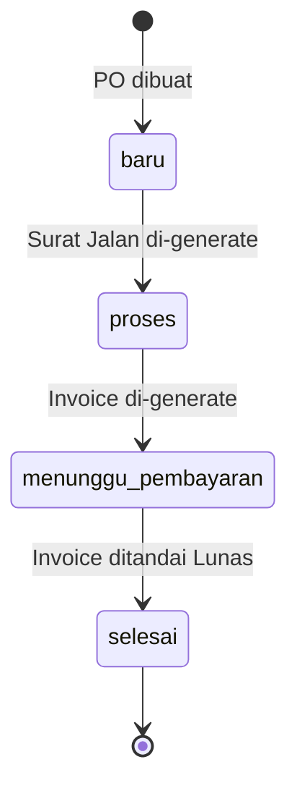
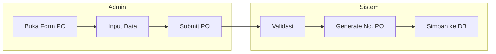

# Activity Diagram — TUKSAY ERP

> **Sistem:** TUKSAY - Fresh Produce Supplier Management System  
> **Standar:** UML 2.x  
> **Format:** Mermaid Flowchart (dirender di GitHub, GitLab, Obsidian, dsb.)

---

## Daftar Alur (Swimlane)

| Swimlane | Aktor |
|---|---|
| Admin / Owner | Pengguna utama, akses penuh |
| Sistem (TUKSAY ERP) | Proses otomatis backend Laravel |
| Karyawan | Akses terbatas: Daftar Belanja |

---

## 1. Alur Pembuatan Purchase Order

**Aktor yang terlibat:**
- `Admin/Owner` → A1 hingga A5
- `Sistem` → S1 hingga S4

---

## 2. Alur Konsolidasi Daftar Belanja

**Aktor yang terlibat:**
- `Karyawan` → K1 hingga K4
- `Sistem` → S1 hingga S6

---

## 3. Alur Generate Surat Jalan

**Aktor yang terlibat:**
- `Admin/Owner` → A1 hingga A5
- `Sistem` → S1 hingga S6

---

## 4. Alur Generate Invoice

**Aktor yang terlibat:**
- `Admin/Owner` → A1 hingga A6
- `Sistem` → S1 hingga S6

---

## 5. Alur Pembayaran Invoice (Tandai Lunas)

**Aktor yang terlibat:**
- `Admin/Owner` → A1 hingga A3
- `Sistem` → S1 hingga S4

---

## 6. Alur Dashboard & Laporan Keuangan

**Aktor yang terlibat:**
- `Admin/Owner` → A1 hingga A3
- `Sistem` → S1 hingga S8

---

## Ringkasan Transisi Status Purchase Order

---

## Contoh Swimlane dengan subgraph

Untuk keperluan formal (skripsi/tugas akhir), gunakan `subgraph` untuk menandai swimlane:

---

## Catatan Penulisan

- Diagram ini menggunakan sintaks **Mermaid** yang dapat dirender langsung di:
  - **GitHub / GitLab** (dalam file `.md`)
  - **Obsidian** (dengan plugin Mermaid)
  - **VS Code** (dengan ekstensi Markdown Preview Mermaid Support)
  - **draw.io** / **Lucidchart** (import via plugin)
- Setiap diagram dapat dipisah menjadi diagram mandiri sesuai kebutuhan laporan atau skripsi.
- Node `A` = aktivitas oleh **Aktor** (Admin/Karyawan)
- Node `S` = aktivitas oleh **Sistem** (backend Laravel)
- Node `K` = aktivitas oleh **Karyawan** khusus

---

*TUKSAY ERP — Fresh Produce Supplier Management System*  
*Activity Diagram · UML 2.x · Draft*
